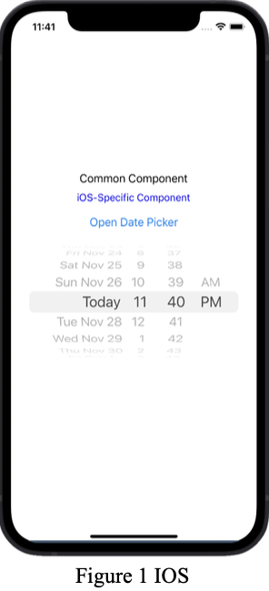
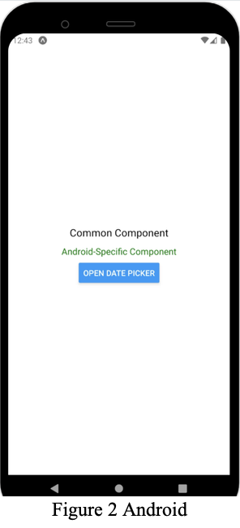

# Platform-Specific Component App

## Overview
This project demonstrates the creation of a React Native component that behaves differently based on the operating system (iOS or Android). The app showcases platform-specific UI and functionality, including a date picker component customized for each platform.

---

## Features

### 1. Common Functionality
- The app displays common elements that are shared across both iOS and Android platforms.
- Provides a single button to open the date picker, adapting behavior based on the platform.

### 2. iOS-Specific Features
- Displays a label indicating iOS-specific behavior.
- Utilizes the `DatePickerIOS` component for selecting a date.
- The date picker is rendered directly within the app's layout when activated.

### 3. Android-Specific Features
- Displays a label indicating Android-specific behavior.
- Uses the `DatePickerAndroid` API to open a native date picker dialog.
- Selected dates are updated only after the user confirms their choice in the dialog.

---

## User Interface

### Components
- **Common Components:** Include the shared button and label.
- **iOS Components:** A text label and inline date picker specific to iOS.
- **Android Components:** A text label and native date picker dialog specific to Android.

### Styling
The app employs a `StyleSheet` for consistent styling, with platform-specific styles for text and other elements:
- **Common Text:** Shared styling for labels across platforms.
- **Android-Specific Text:** Styled in green to distinguish Android-specific features.
- **iOS-Specific Text:** Styled in blue to distinguish iOS-specific features.

---

## Key Takeaways
- The `Platform` module in React Native allows for conditional rendering and behavior based on the operating system.
- iOS and Android provide distinct methods for implementing features like date pickers, necessitating platform-specific logic.
- React Native's flexibility enables developers to write adaptive and reusable code while delivering a native experience for each platform.

Feel free to enhance this app by adding more platform-specific components or extending the functionality of the date picker.
